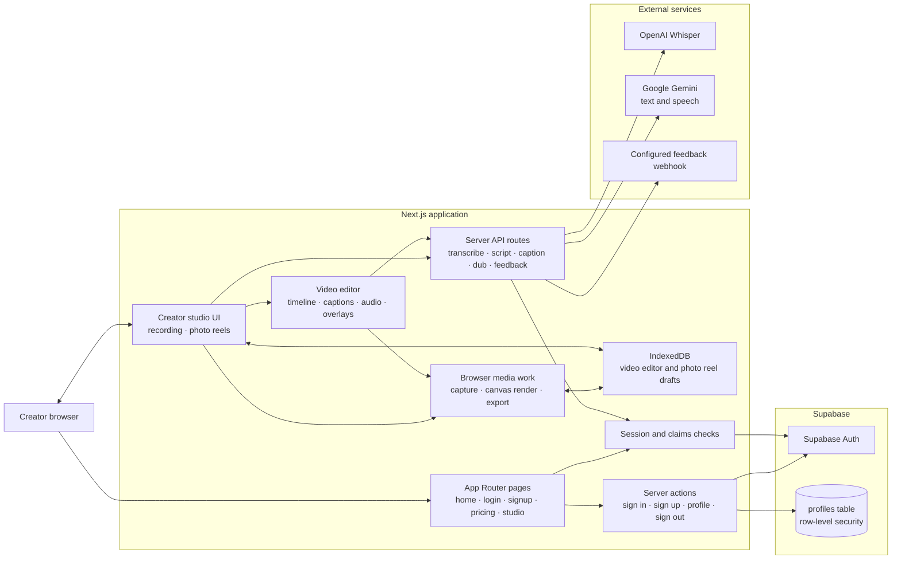
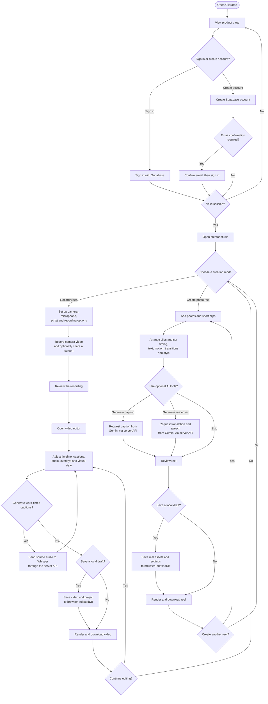

# Cliprame architecture and creator flow

Cliprame is a browser-based creator studio built with Next.js App Router. The diagrams below describe the current implementation; in particular, saved projects are device-local and are not synchronized to user accounts.

## Architecture

### Data and service boundaries

- The Next.js app serves the public pages and the protected studio. Supabase sessions are checked on the server for studio access and AI routes. A separately configured temporary demo session can also unlock the studio.
- Supabase Auth owns user identity. The `profiles` table stores display names and restricts reads and updates to the authenticated owner with row-level security.
- Camera, microphone, and optional display capture happen in the browser. Video and photo-reel rendering/export use browser media and canvas APIs.
- Video-editor drafts (including source video and music blobs) and photo-reel drafts (including clip, music, and voiceover blobs) are stored in separate IndexedDB databases on the current browser/device. They are not account-backed or synchronized.
- `/api/transcribe` forwards audio to OpenAI Whisper. `/api/generate-script`, `/api/generate-reel-caption`, and `/api/dub` call Google Gemini. Provider credentials remain server-side; these routes require an authenticated session (Supabase, or a demo session when demo auth is enabled and Supabase is not configured).
- `/api/feedback` forwards a rating and comment to the configured webhook. It does not attach video or account data.
- The prototype has no configured billing or paid-plan entitlement flow. Recording and exports currently have a 60-second free limit and a watermark.

## Creator flow

### Optional AI steps

While signed in, the editor can send captured source audio to `/api/transcribe` for word-timed captions. The teleprompter can request a script from `/api/generate-script`; photo reels can request a caption from `/api/generate-reel-caption` or translated speech from `/api/dub`. The server validates each request and calls the configured provider; results return to the browser for review and editing.
